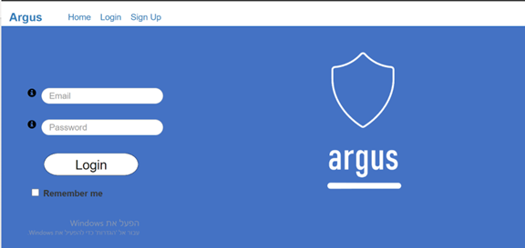
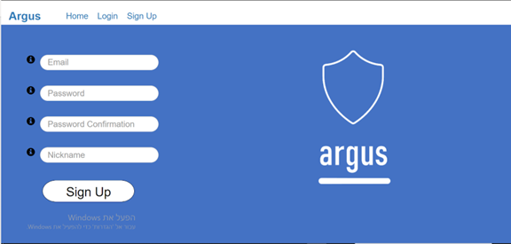
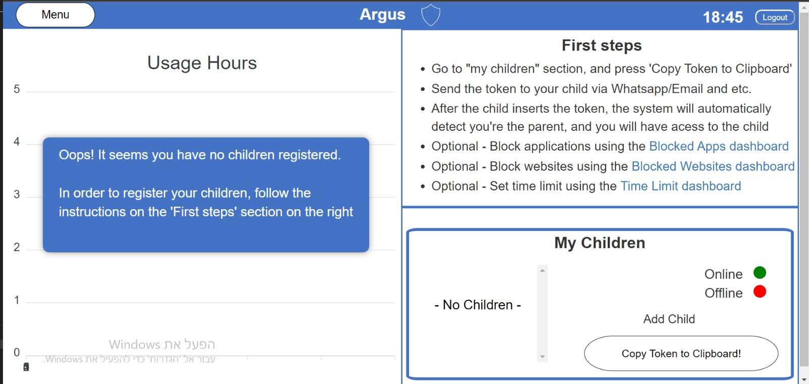
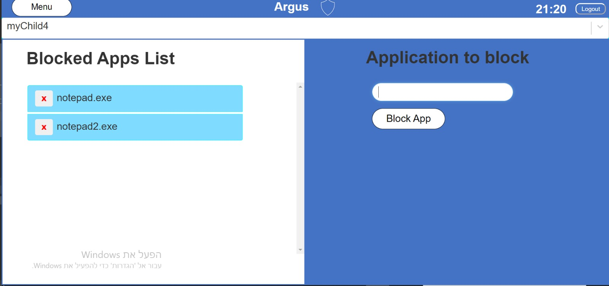
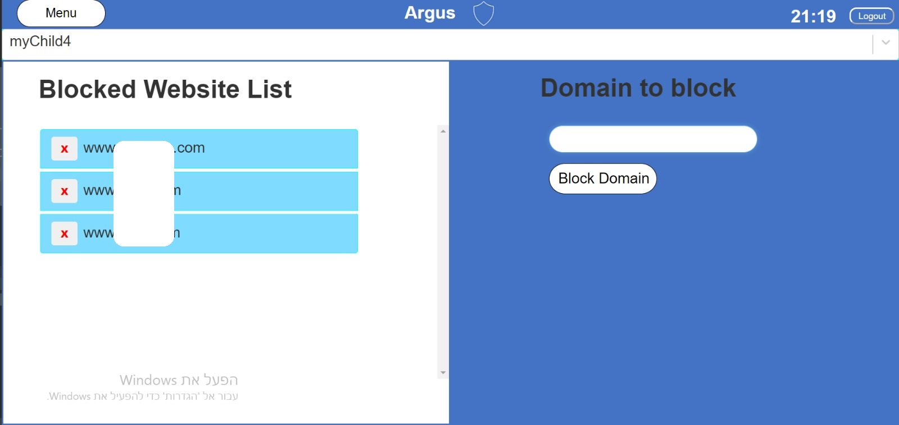
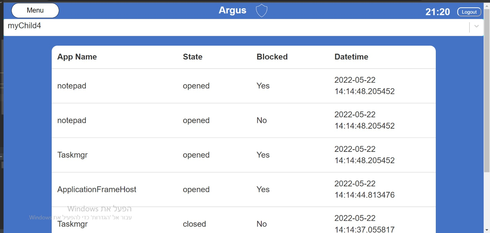
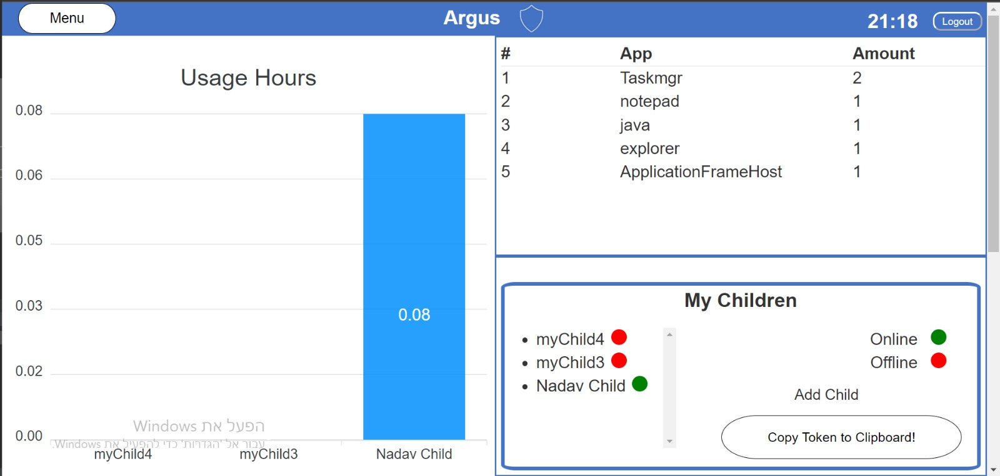
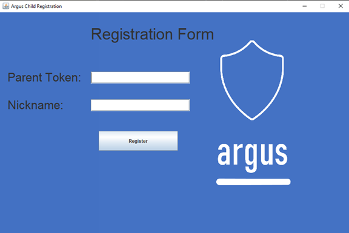
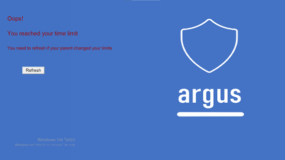

# Info
High-school final project with grade of 100.
Monitoring computers with ability to block unwanted website traffic, app use, limit time and observe the child's computer use

# Screenshots
## Parent login

## Parent register

## New parent

## Time limit settings

## Blocked apps settings

## Blocked websites settings

## Apps history

## Parent dashboard

## Child registration

## Child time limit

# Endpoints
## /parent
| Methods | Parameters                      | Auth   |
|---------|---------------------------------|--------|
| POST    | email  password  nickname | None   |
| GET     | None                            | Parent |
| PATCH   | email (optional)  password (optional)  nickname(optional) | Parent |
  

#### /parent/child_registration_token
| Methods | Parameters | Auth |
|---------|------------|------|
| GET     | None       | Parent
  

## /child
| Methods | Parameters                                  | Auth  |
|---------|---------------------------------------------|-------|
| POST    | mac_address  nickname   parent_token  | Token |
| GET     | id   field (optional)                    | Parent|
| PATCH   | id   nickname (optional)   blocked (optional)   usage_limits (optional)| Parent|
  

#### /child/activity
| Methods | Parameters           | Auth |
|---------|----------------------|------|
| POST    | None                 | Child
| GET     | id   amount       | Parent
  

#### /child/web_history
| Methods | Parameters | Auth |
|---------|------------|------|
| POST    | 
| GET     | 
| PATCH   |
  

## Others
#### /blocked_websites
| Methods | Parameters            | Auth |
|---------|-----------------------|------|
| POST    | id   domain  | Parent
| GET     | id                    | Parent/ Child
| DELETE  | child_id   domain  | Parent
  

#### /commands
| Methods | Parameters            | Auth |
|---------|-----------------------|------|
| POST    | id   | Parent
| GET     | id                    | Parent/ Child
| DELETE  | child_id   command | Parent
  

## Protection levels
| Protection Level  | Number    | Description                   |
|-------------------|-----------|-------------------------------|
| NO                | 0         | No protection at all. All domains are allowed.
| MINIMAL           | 1         | Blocks customized domains
| NORMAL            | 2         | * Blocks domains from our saved list   * Customized domains
| HARD              | 3         | Blocks all web traffic

## Password format
## Available commands
